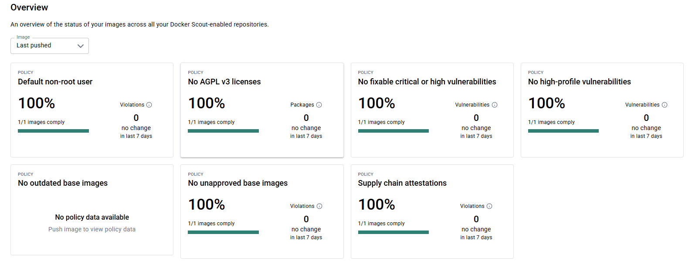
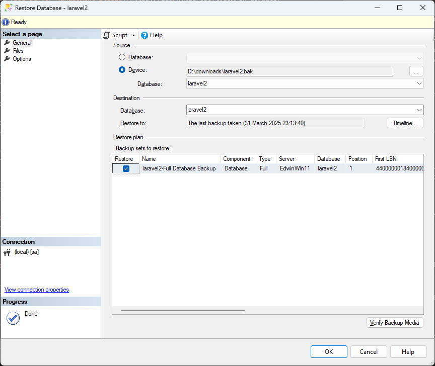
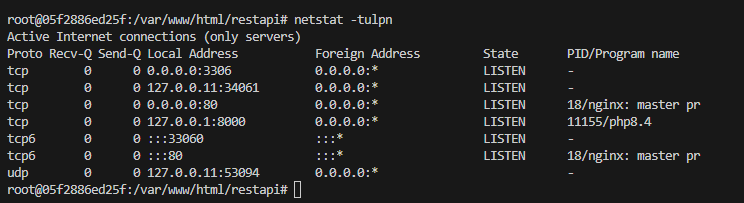
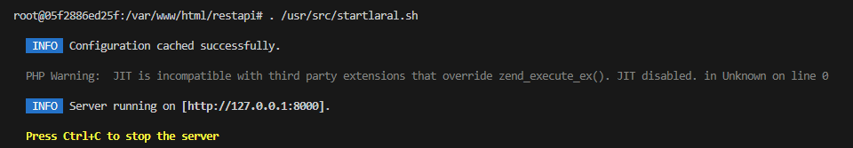
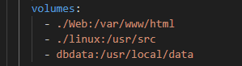

### Debuggable Laravel Application with Docker & SQL Server - Local Development

### Introduction
Learn to develop your Laravel application locally using Docker, simplifying the deployment and maintenance process. This guide walks you through setting up a pre-configured Docker image, enabling seamless connectivity to your SQL Server database, and providing a reliable development environment.

This is a brief, proof-of-concept example of Laravel JWT authentication. While it is not comprehensive and doesn't implement HTTPS-only cookies for the refresh token, it is functional. Programmers should be able to integrate this code directly into a Laravel environment for testing and debugging

My current Docker image is compliant with the Docker Scout vulnerability check. (Oct 14, 2025)


### Prerequist installation
- Microsoft Windows 10/11.
- Download [Visual Studio Code on Windows](https://code.visualstudio.com/sha/download?build=stable&os=win32-x64-user) 
- Download [Notepad++](https://github.com/notepad-plus-plus/notepad-plus-plus/releases/download/v8.8.6/npp.8.8.6.Installer.x64.exe)
- Download [Github for windows](https://git-scm.com/downloads)
- Download [SQL 2022 Developer Edition](https://go.microsoft.com/fwlink/p/?linkid=2215158&clcid=0x409&culture=en-us&country=us)
- Download [Docker Desktop for Windows](https://docs.docker.com/desktop/setup/install/windows-install/)
- Download [SQL Server Management Studio](https://learn.microsoft.com/en-us/ssms/install/install)  
- Download [Postman](https://dl.pstmn.io/download/latest/win64) (this is for testing api)

---  

### Install and setup procedures
1. Configure Git to support Unix line endings (LF).
```bash
git config --global core.autocrlf input
```
2. Run the script below to clone the Git repository with the Docker setup and PHP source code into the chosen directory. 
```bash
git clone https://github.com/edwinwcw2021/laravel_docker.git
cd laravel_docker
```
3. Download the MSSQL backup file [here](https://freeware.vagweb.com/laravel2.bak).
4. Restore the backup to your MSSQL Developer server.

5. Run the following script to pull the Docker image, create the necessary volume, and create the Docker container:
```bash
docker volume create dbdata
docker compose up -d --build
```
6. Execute the script below to open a Bash shell within the Docker container, or use VS Code to run postinstall.sh as shown in the YouTube tutorial: 
```bash
bash.bat
```
7. Execute the post-install script below in a Linux Bash shell: (This script will initialize MySQL and download my tested vendor files for Laravel. You can run it using composer update in the Dev Console in VS Code.)
```bash
sudo su -
. /usr/src/postinstall.sh
```
8. Configure MySQL and start debugging and laravel. For details, please refer to youtube.
```bash
. /usr/src/startlaral.sh
```


9. Finally. Use Postman to test the RestAPI functionality   

---

### Technical Information
1. Microsoft ODBC Driver 18 for SQL Server in Linux
2. Laravel Framework 11.46.1
3. Ubuntu Linxu 22.04
4. Nginx/1.18.0
5. Php 8.4
6. MySQL Community Server 9.2.0
6. Once the development environment is set up, find additional information [here].


### Usage Guide for further development and System Design
1. Mount Point 1 (Configuration and Startup): The local folder .\linux is mounted to the container path /usr/src. This mount is used for startup scripts and configuration files to be executed inside the Docker container during setup and development. This mount point can be utilized for further development.

2. Mount Point 2 (Web Development): The local folder .\Web is mounted to /var/www/html. This links directly to the PHP source code. If the code was obtained via git clone, please delete the .git folder within this mount point to prevent conflicts with your own version control.

3. Mount Point 3 (Database Persistence): A named volume, dbdata, is created and mounted to persist the MySQL database files. This volume can be reused across different projects. You can reuse this base Docker image by creating new containers with different port assignments and additional mount points. This design ensures data persistence and reuse. Even if the container is droped and recreated with a different image, the data will remain safely stored as long as the volume is referenced.



4. Please note that this Docker setup is intended for development use only. It should not be deployed directly to any production system. Additional work is required for a production release — for example, the .env file should never be placed in the root directory of the code.

5. I set up this Docker environment over seven months ago, but additional work is needed before it can be released to Docker Hub. For development and debugging PHP code on your local PC, having root access is much more convenient — especially when using the VS Code remote debugger.

[Detailed instructions follow after the prerequisite installation.](https://www.youtube.com/)